# NTNU KPRO AI Assistant

Each year, the Norwegian public spends about 5.6 billion NOK on planning and validating building applications. The process is complex, time-consuming, and often yields poor-quality submissions. The KartAI project aims to streamline this by developing AI tools to support the application process. The project is a collaboration between the Norwegian University of Science and Technology (NTNU) and KartAI.

KatAI's main goal is to streamline municipal work processes related to cadastre and building case processing using automated, advanced data-driven methods, including artificial intelligence in combination with proactive user and citizen dialogue. The goal is to contribute to automating and streamlining the processing of building cases.


The scope of the project consists of two primary objectives:

* **Develop a Web Application:** This platform will serve as a centralized hub, integrating the various AI models available through the KartAI project. By bringing these models together, the application will serve as a proof-of-concept (PoC), allowing KartAI to display their assortment of AI tools for different stages of the application process.

* **Create a Summary AI Assistant:** This AI-driven tool analyze documents from submitted applications and generate concise summaries, highlighting key points. The system implements a checklist matching feature. It cross-reference the building application with an official checklist and relevant regulations and inform about the quality of the application. This functionality is designed to support both applicants and case workers, enhancing the overall efficiency and clarity of the application process


## Final Product
The following is a brief overview of the final product, including the system architecture and screenshots of the web application and the AI Summary Assistant.


### Screenshots of the Final Product


<details>
<summary><b>Click to see Web Application screenshots</b></summary>

1. **Landing Page**  
   The landing page for the web application.  
   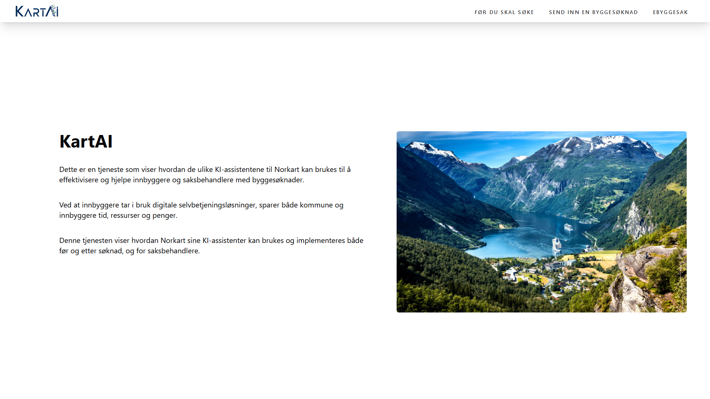

2. **Landing Page with Navbar**  
   The landing page with the navigation bar displayed.  
   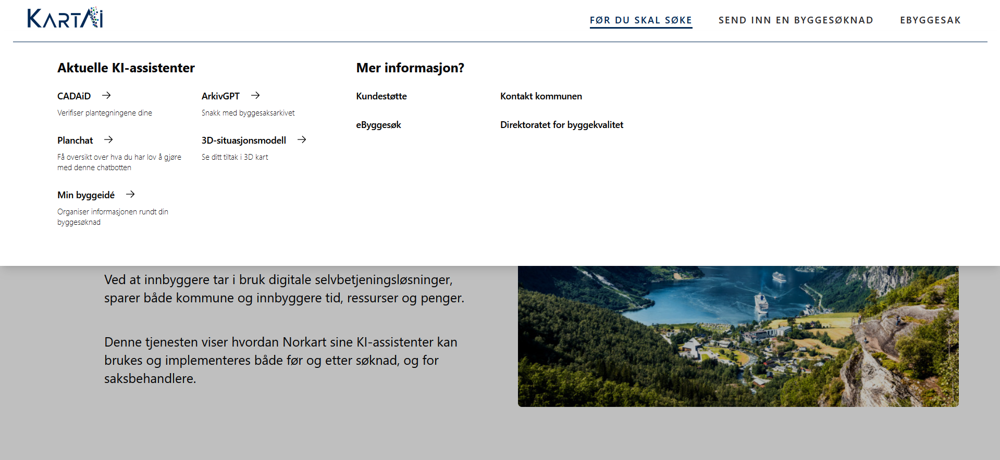

3. **3D Tiltaksvisning**  
   The page for 3D visualization of projects.  
   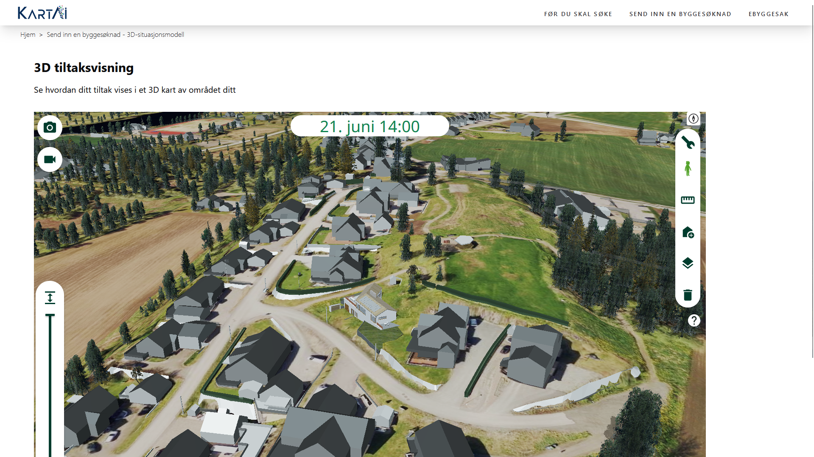

4. **PlanChat**  
   A chat window designed to answer questions about laws and regulations.  
   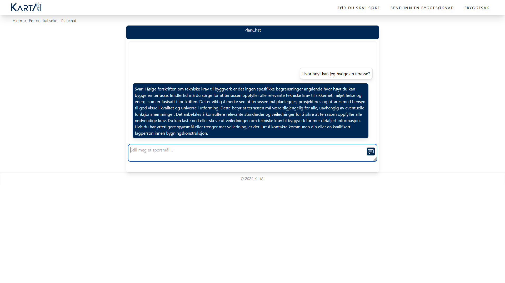

5. **ArkivGPT Interface**  
   The user interface for interacting with the ArkivGPT AI model.  
   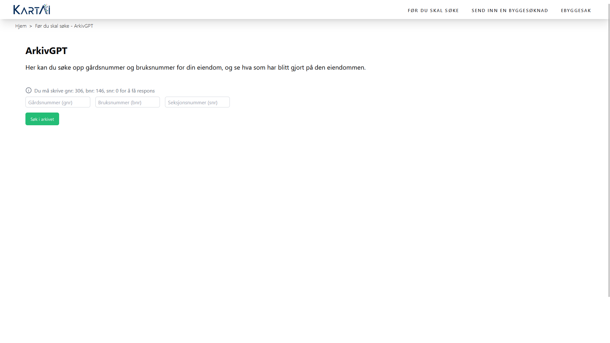

6. **ArkivGPT Results**  
   Displaying results from an ArkivGPT query.  
   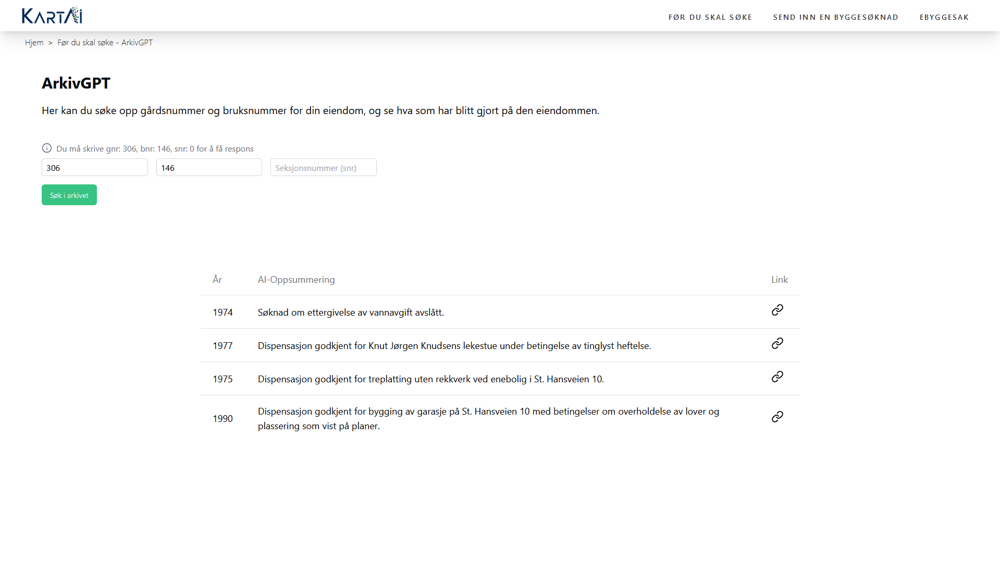

7. **File Preview**  
   Previewing files related to ArkivGPT queries.  
   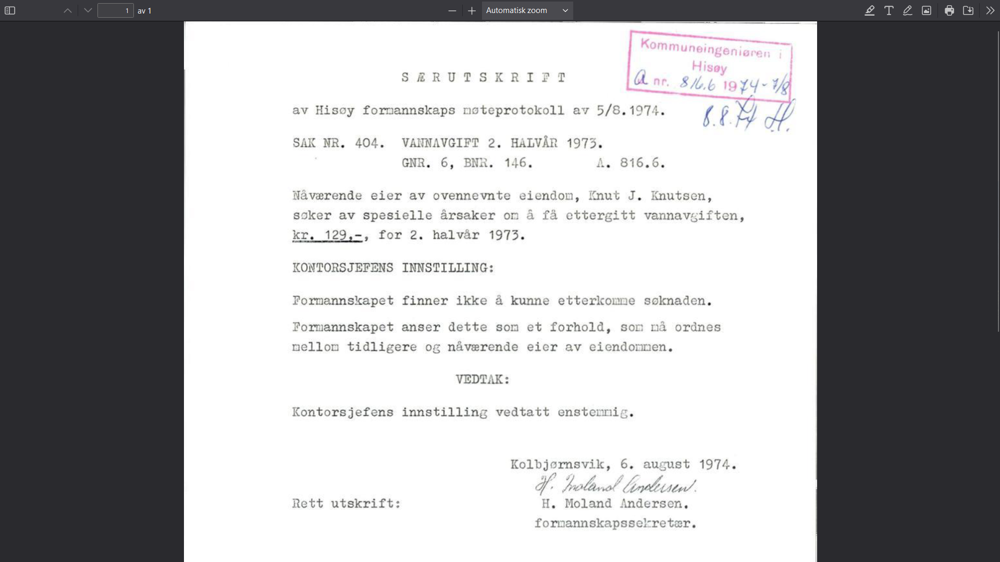

8. **CADAiD Request**  
   User interface for requesting validation from the CADAiD model.  
   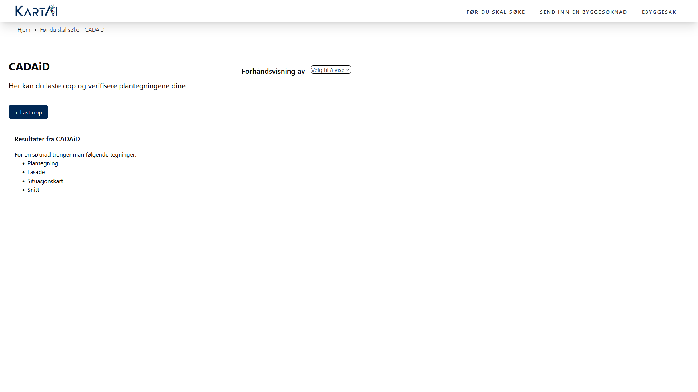

9. **CADAiD Results**  
   Results generated from the CADAiD model.  
   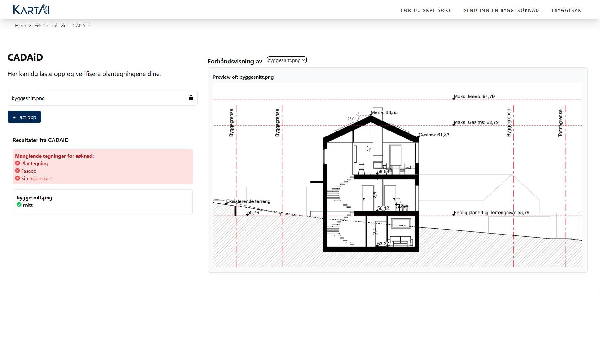

10. **Applications Overview**  
    A page showing an overview of applications for municipality workers.  
    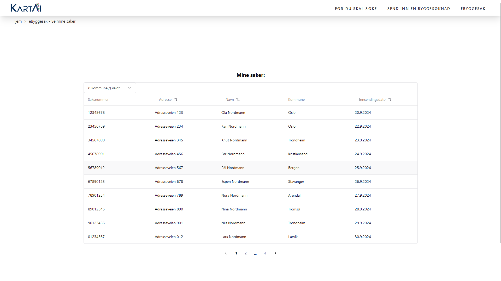

11. **Municipality Dashboard (Top)**  
    The dashboard for municipality workers showing checklist maps.  
    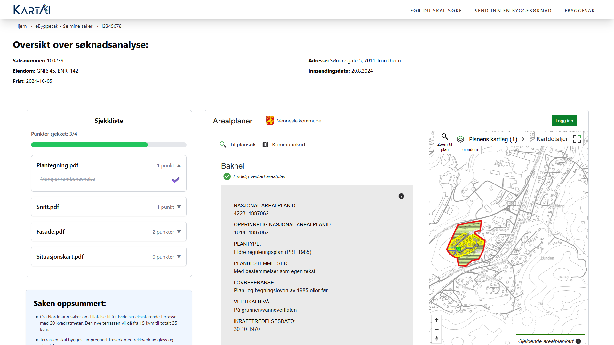

12. **Municipality Dashboard (Bottom)**  
    The dashboard displaying checklist maps and AI model results.  
    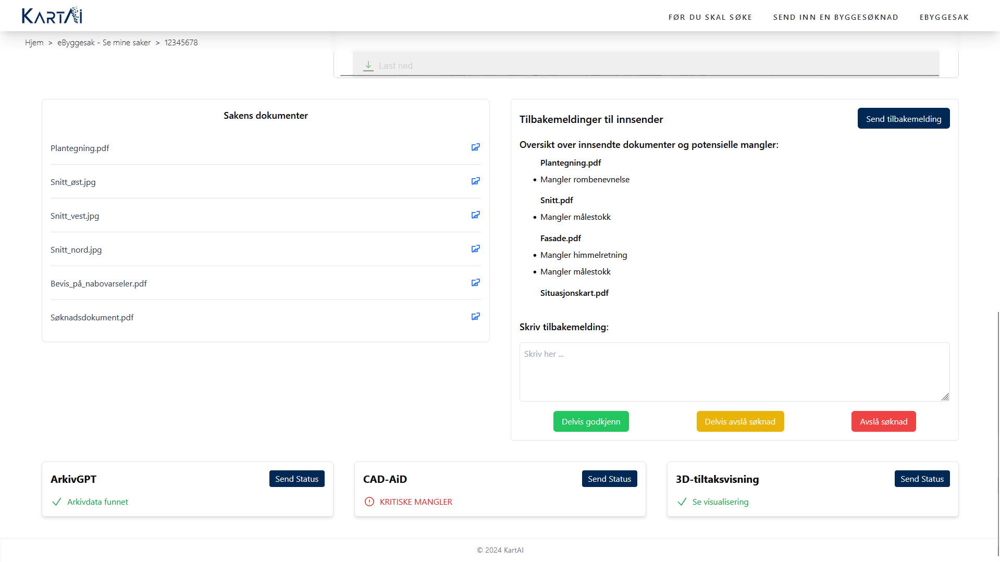

13. **User Dashboard**  
    The dashboard where applicants can review their applications using various AI models.  
    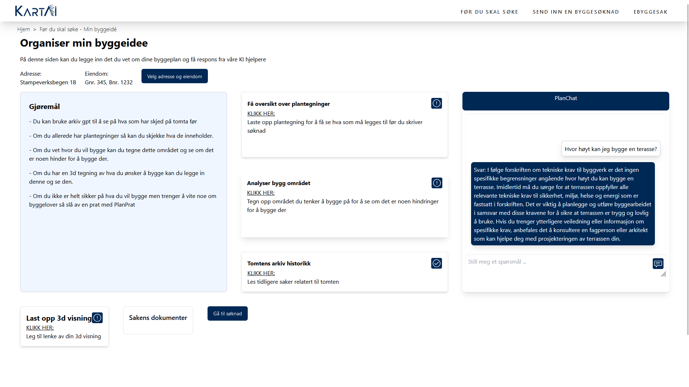


</details>

<details>
<summary><b>Click to see AI Summary Assistant Screenshots</b></summary>

1. **AI Summary Assistant**
   The graph showing the AI agent structure.
   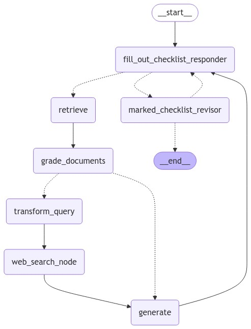
2. **LangSmith tracking**
   The monitoring of the agent showing what choices it makes.
   Here one can see the agent have retrieved relevant laws and regulations from vector database and done a web search, as well reflect on the output of it self before marking the checkpoint and giving its reasoning.
   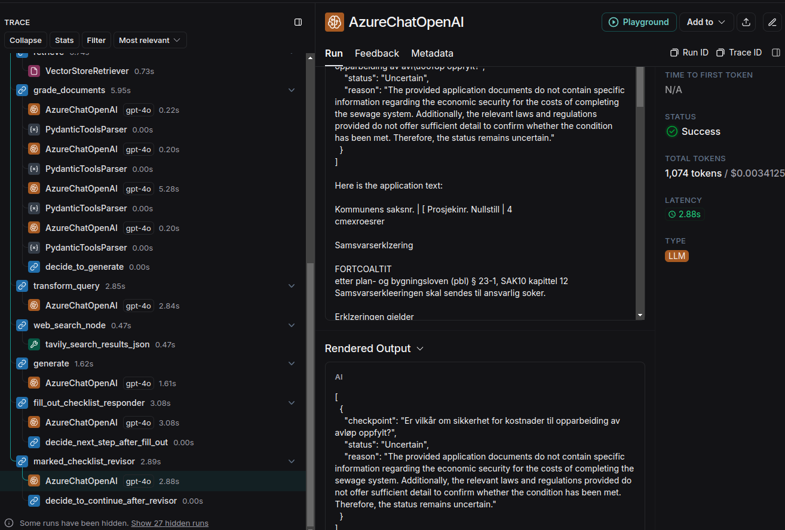
</details>

## Prerequisites

Before you start, make sure the following tools are installed on your system:

- **Git:** Version control system to clone the project repository [Download Git](https://git-scm.com/downloads)
- **Docker:** To containerize the application and ensure it runs consistently across different environments [Download Docker](https://www.docker.com/products/docker-desktop)

## Setup

Start by going into the `/webapp` folder, making a copy of the `.env.example` file and renaming it to `.env`. This file contains the environment variables that the application needs to run. Open the `.env` file and update the environment variables according to your local or production setup.

## Usage

To run the project, you can use the following commands:

```bash
docker compose --env-file ./webapp/.env  --env-file ./backend/.env up --build -d
```

This command will build the Docker images (if necessary) and run the containers in the background. You can access the clientside code at [http://localhost:3000](http://localhost:3000) and the API at [http://localhost:8000](http://localhost:8000).
The Swagger documentation for the API is available at [http://localhost:8000/docs](http://localhost:8000/docs).

To stop the containers, you can use the following command:

```bash
docker compose down
```

**Important:** In order to achieve the full functionality of the application, the AI models from the KartAI project must also be running. In our development we have ran them as docker containers locally on our machines. Though in the future, these will hopefully be available as public APIs.

## Documentation

- [Developer Setup](/docs/manuals/developer_setup.md)
- [T3 Start Guide](/docs/manuals/t3_guide.md)


## Team

The team behind this project is a group of students at NTNU in Trondheim. The team consists of:

<table align="center">
    <tr>
        <td align="center">
            <a href="https://github.com/andreaslhjulstad">
               <br />
               <sub><b>Andreas Lilleby Hjulstad</b></sub>
            </a>
         </td>
         <td align="center">
               <a href="https://github.com/ArtemisAaroe">
                  <br />
                  <sub><b>Artemis Kjøllmoen Aarø</b></sub>
               </a>
         </td>
         <td align="center">
               <a href="https://github.com/johanneeo">
                  <br />
                  <sub><b>Johanne Eide Olsnes</b></sub>
               </a>
         </td>
         <td align="center">
               <a href="https://github.com/magnusgiverin">
                  <br />
                  <sub><b>Magnus Giverin</b></sub>
               </a>
         </td>
         <td align="center">
               <a href="https://github.com/maurice-wegerif">
                  <br />
                  <sub><b>Maurice Wegerif</b></sub>
               </a>
         </td>
        <td align="center">
            <a href="https://github.com/SverreNystad">
               <br />
               <sub><b>Sverre Nystad</b></sub>
            </a>
        </td>
    </tr>
</table>
